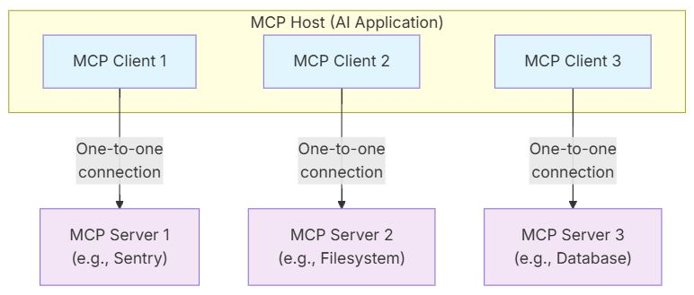

# MCP

## 參考資源
- [GitHub MCP](https://github.com/modelcontextprotocol/python-sdk/)
- [GitHub FastMCP](https://github.com/jlowin/fastmcp)
- [MCP Documentation](https://modelcontextprotocol.io/)
- [FastMCP Documentation](https://gofastmcp.com/)

## 什麼是 MCP?

MCP (Model Context Protocol) 是一種用於大型語言模型 (LLM) 與上下文服務之間溝通的協定，設計目的是讓 LLM 能夠透過標準化的方式取得上下文資訊。

MCP 讓你能夠建立伺服器，安全且標準化地向 LLM 應用程式提供資料與功能。

### MCP 架構

- MCP 採用 Client-Server 架構，MCP 可以分為三個部分 MCP Host、MCP Client 及 MCP Server。其中 MCP Host 會建立一個或多個與 MCP Server 的連線，且每個 MCP Client 與其對應的 MCP Server 會保持一對一的連線。
    - MCP Host： LLMs 或 AI 應用程式，例如 Claude Code、Claude Desktop、GitHub Copilot 等。
    - MCP Client： 由 MCP Host 實例化。維護與 MCP Server 的連線，並從 MCP Server 取得上下文以供 MCP Host 使用。
        - Sampling： 向 LLMs 請求模型補全。
        - Elicitation： 向使用者請求更多資訊。
        - Logging： 傳送日誌訊息。
    - MCP Server： 一個應用程式提供 MCP Client 上下文，可以在本地 (Stdio) 或遠端執行 (SSE, Streamable HTTP)。
        - Tools： 可執行的函式，例如檔案操作、資料庫查詢、API 呼叫。
        - Resources： 資料來源，例如檔案內容、資料庫記錄、API 回應。
        - Prompts： 可重複使用的模板。
    - 
- MCP 由 Data Layer 和 Transport Layer 兩層組成。
    - Data Layer： 定義基於 JSON-RPC 的 Client-Server 通訊協定，包含 Lifecycle Management、Primitives、Notifications 等。
    - Transport Layer： 定義 Client 和 Server 之間資料交換的通訊機制和管道，包含 Transport-Specific Connection Establishment、Message Framing、Authorization。

## 安裝方式

透過 uv 安裝：

```
uv add mcp[cli]
uv add fastmcp
```

透過 Scoop 安裝 node.js：

```
scoop install nodejs
```

透過 node.js 安裝 mcp-remote：

```
npm install mcp-remote
```

## 建立第一個 MCP Server

- 建立檔案 `mcp\src\server.py`，並輸入以下命令。
    - 建立一個 MCP Server 名為 `demo`，註冊 MCP Tools，在本機啟動 MCP Server。
    ```python
    """Create a MCP server, register tools, and run MCP server."""

    from mcp.server.fastmcp import FastMCP

    from tools.register import register_tools


    def main() -> None:
        """Create a MCP server, register tools, and run MCP server."""
        mcp = FastMCP(name="demo", port=8000)
        register_tools(mcp)
        mcp.run(transport="stdio")

    if __name__ == "__main__":
        main()
    ```
- 建立檔案 `mcp\src\tools\register.py`，並輸入以下命令。
    - 透過 `@mcp.tool()` 裝飾器定義 MCP Tools。
    ```python
    """Register tools."""

    from mcp.server.fastmcp import FastMCP


    def register_tools(mcp: FastMCP) -> None:
        """Register tools."""

        @mcp.tool()
        def add(a: int, b: int) -> int:
            """Add two numbers."""
            return a + b
    ```
- 開啟 VS Code，按下 `F1` 開啟命令選單, 搜尋 `MCP: Add Server`，選擇 `Command (stdio)`，可以新增設定於 User Settings 的 `settings.json` 或是 Workspace Settings 的 `.vscode/mcp.json`，輸入以下設定至設定檔中。
    - 注意在 Windows 上的路徑的反斜線 `\`，需要要轉換為雙反斜線 `\\`。
    ```json5
    {
        "mcp": {
            "servers": {
                "demo": {
                    "type": "stdio",
                    "command": "uv",
                    "args": [
                        "--directory",
                        "C:\\path\\mcp\\src",
                        "run",
                        "server.py"
                    ]
                }
            }
        }
    }
    ```
- 最後開啟 GitHub Copilot Chat View 的 Agent Mode，按下 New Tools Avaiable (Refresh Icon)，即可在 Configure Tools 看到新加入的工具。

## MCP 傳輸方式

- Stdio (Standard Input Output)
    - 透過標準輸入輸出，將 Request 送至 MCP Server。
- SSE (Server-Sent Events)
    - 由 Client 向 Server 發送 HTTP 的 POST 請求，建立 SSE 連線，然後 Server 會持續透過 SSE 連線，單向由 Server 向 Client 傳送事件。
    ```python
    """Create a MCP server, register tools, and run MCP server."""

    from mcp.server.fastmcp import FastMCP

    from tools.register import register_tools


    def main() -> None:
        """Create a MCP server, register tools, and run MCP server."""
        mcp = FastMCP(name="demo", port=8000)
        register_tools(mcp)
        mcp.run(transport="sse")

    if __name__ == "__main__":
        main()
    ```
    ```json5
    {
        "mcp": {
            "servers": {
                "demo-sse": {
                    "type": "sse",
                    "args": [
                        "mcp-remote",
                        "http://localhost:8000/sse"
                    ]
                }
            }
        }
    }
    ```
- Streamable HTTP
    - 透過 HTTP 的 POST 方法，實現 Client 與 Server 雙向溝通的功能。
    ```python
    """Create a MCP server, register tools, and run MCP server."""

    from mcp.server.fastmcp import FastMCP

    from tools.register import register_tools


    def main() -> None:
        """Create a MCP server, register tools, and run MCP server."""
        mcp = FastMCP(name="demo", port=8000)
        register_tools(mcp)
        mcp.run(transport="streamable-http")

    if __name__ == "__main__":
        main()
    ```
    ```json5
    {
        "mcp": {
            "servers": {
                "demo-http": {
                    "type": "http",
                    "args": [
                        "mcp-remote",
                        "http://localhost:8000/mcp"
                    ]
                }
            }
        }
    }
    ```

## MCP Logging

- 實做 Stdio 的 MCP Server 時，需要小心處理 logging，寫入到標準輸出 (例如 `print()`) 可能會破壞 JSON-RPC 訊息，並破壞 MCP Server。
- 但實做 SSE 或 Streamable-HTTP 的 MCP Server 時，寫入到標準輸出不會影響 HTTP 的回應。
    ```python
    import logging
    logging.info("something...")
    ```

## MCP Inspector

- MCP Inspector 是一款用於測試和調試 MCP Server 的互動式開發者工具，提供圖形化介面來觀察、發送請求與檢查回應，方便開發者快速定位問題與驗證功能。
- 安裝 MCP Inspector。
    ```
    npm i @modelcontextprotocol/inspector
    ```
- 執行 MCP Inspector。
    ```
    npx @modelcontextprotocol/inspector
    ```

## 常用的 MCP

- [MCP FileSystem](https://github.com/modelcontextprotocol/servers/tree/main/src/filesystem) 檔案系統操作。
    - 一部分的檔案系統操作功能也可以使用 MCP Client 的 Roots 功能來達成，例如 VS Code 有支援 Roots 功能。
    - 注意在 Windows 上的路徑的反斜線 `\`，需要要轉換為雙反斜線 `\\`。
    - 將以下 json 加入 mcp 設定檔。
        ```json5
        {
            "servers": {
                "filesystem": {
                    "type": "stdio",
                    "command": "npx",
                    "args": [
                        "-y",
                        "@modelcontextprotocol/server-filesystem",
                        "/path/to/other/allowed/dir"
                    ]
                },
            }
        }
        ```
    <details>
    <summary>FileSystem 的功能</summary>

    - 讀取、寫入、修改檔案。
        - read_file
        - read_text_file
        - read_media_file
        - read_multiple_files
        - write_file
        - edit_file
    - 列出、建立資料夾。
        - list_allowed_directories
        - list_directory
        - list_directory_with_sizes
        - directory_tree
        - create_directory
    - 移動、改名檔案或資料夾。
        - move_file
    - 搜尋檔案。
        - search_files
    - 取得檔案的 metadata。
        - get_file_info
        ```
        檔案大小：0 bytes
        建立時間：2025-08-08 11:20:21
        修改時間：2025-08-08 11:20:21
        存取時間：2025-08-08 11:20:21
        是否為資料夾：否
        是否為檔案：是
        權限：666
        ```
    </details>
- [MCP MarkItDown](https://github.com/modelcontextprotocol/servers/tree/main/src/markitdown-mcp) 。
    - 將以下 json 加入 mcp 設定檔。
        ```json5
        {
            "servers": {
                "markitdown": {
                    "type": "stdio",
                    "command": "uvx",
                    "args": [
                        "markitdown-mcp"
                    ],
			        "gallery": true
                },
            }
        }
        ```
    <details>
    <summary>MarkItDown 的功能</summary>

    - 將指定檔案轉為 MarkDown 格式，最好輸入絕對路徑。
        - convert_to_markdown
    </details>

    <details>
    <summary>MarkItDown 的疑難排解</summary>

    - 開啟 Server 時，若出現問題 `ImportError: DLL load failed while importing onnxruntime_pybind11_state`。
        - `onnxruntime` 需要安裝 Visual C++ Redistributable for Visual Studio 2015、2017、2019 和 2022。
        - 下載並安裝 [Visual C++ Redistributable for Visual Studio 2015、2017、2019 和 2022](https://aka.ms/vs/17/release/vc_redist.x64.exe)。
    </details>
- [MCP Memory](https://github.com/modelcontextprotocol/servers/tree/main/src/memory) 。
    - 將以下 json 加入 mcp 設定檔。
        ```json5
        {
            "servers": {
                "memory": {
                    "type": "stdio",
                    "command": "npx",
                    "args": [
                        "-y",
                        "@modelcontextprotocol/server-memory"
                    ]
                },
            }
        }
        ```
    <details>
    <summary>Memory 的功能</summary>

    - 建立、刪除實體。需要輸入實體的名稱、類型、觀察。
        - create_entities
        - delete_entities
    - 建立、刪除關聯。
        - create_relations
        - delete_relations
    - 增加、刪除觀察。
        - add_observations
        - delete_observations
    - 讀取知識圖譜。
        - read_graph
    - 搜尋、開啟節點。
        - search_nodes
        - open_nodes
    </details>
