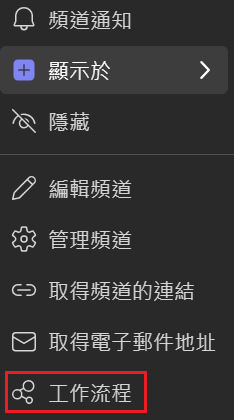
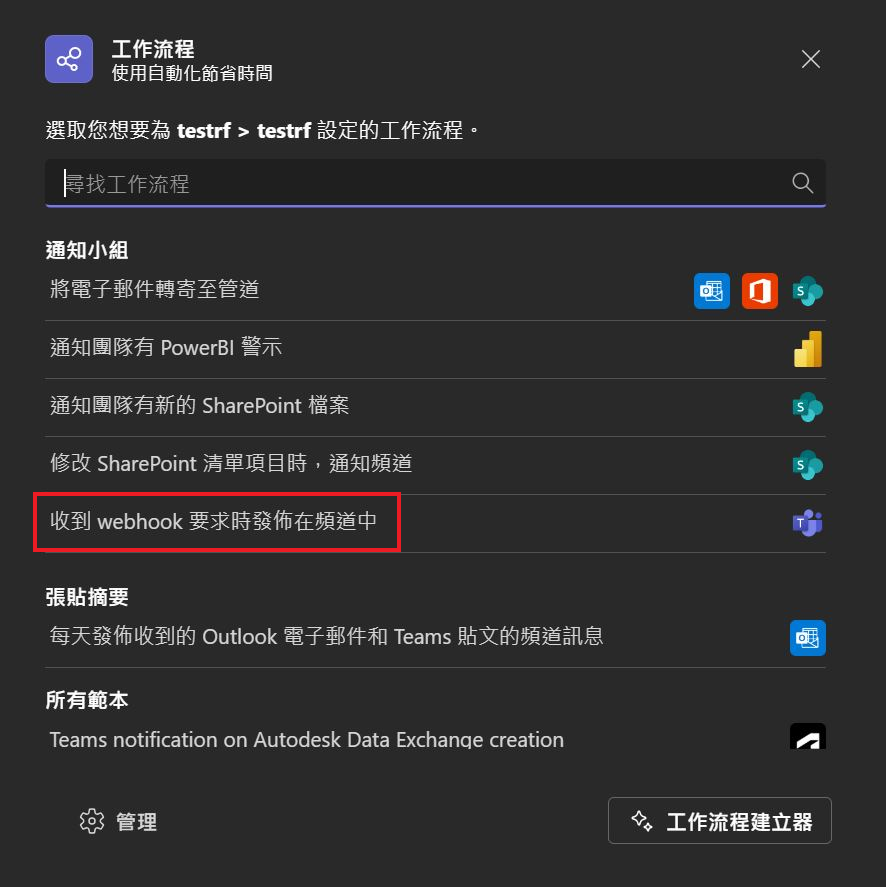
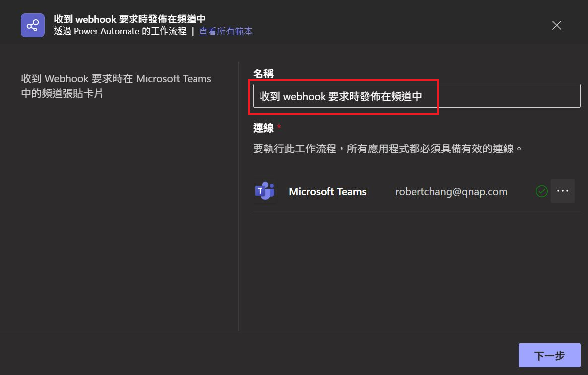
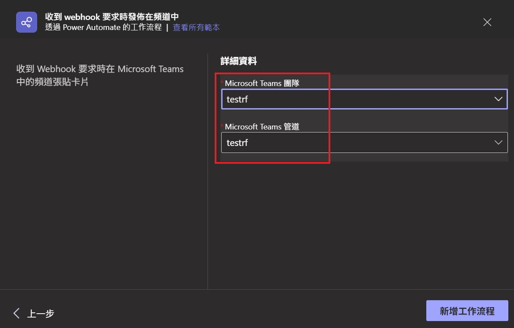
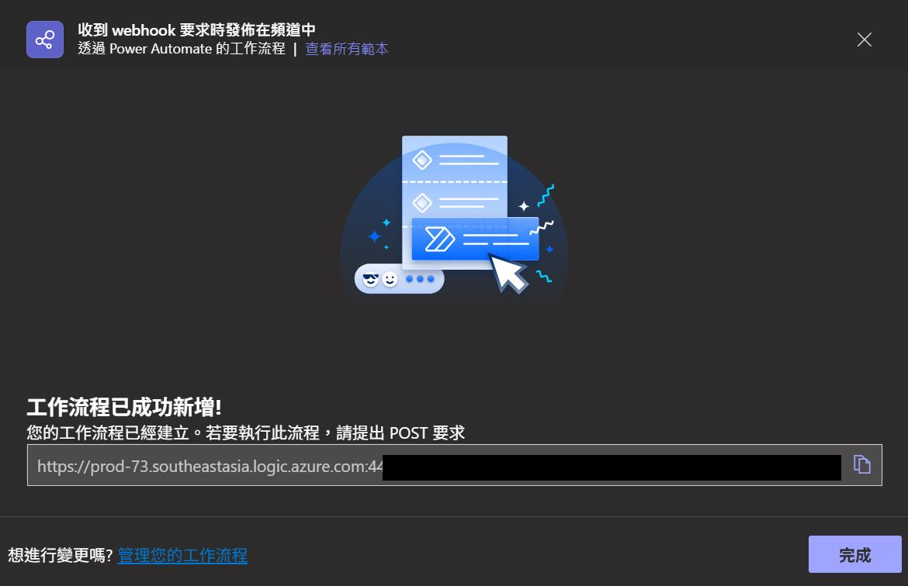

# Microsoft Teams

## 參考資源
- [Microsoft Teams Adaptive Cards Designer](https://adaptivecards.microsoft.com/designer)
- [Microsoft Teams Adaptive Cards Examples](https://learn.microsoft.com/en-us/microsoftteams/platform/task-modules-and-cards/cards/cards-format?tabs=adaptive-md%2Cdesktop%2Cdesktop1%2Cdesktop2%2Cconnector-html)

## 什麼是 Workflows?

Microsoft Teams Workflows 整合與自動化工作流程的功能，讓團隊可以更高效地協作、管理任務並簡化日常作業流程。

## Workflows 發布頻道卡片

- 首先，你的 Teams 要先安裝 Workflows 的應用程式。
- 開啟 Teams，在要建立自動化流程的團隊頻道按下右鍵，選擇工作流程。
    - 
- 選擇收到 webhook 要求時發布在頻道中。
    - 
- 輸入 workflows 名稱，按下下一步，按下新增工作流程，完成建立後複製網址。
    - 
    - 
    - 
- 接著可以使用 Python 的 Requests 送出 Post。
- Python 流程可以參考 `workflows.py`。
    - 需要安裝相關 Python 套件。
        ```python
        uv add python-dotenv
        uv add requests
        ```
